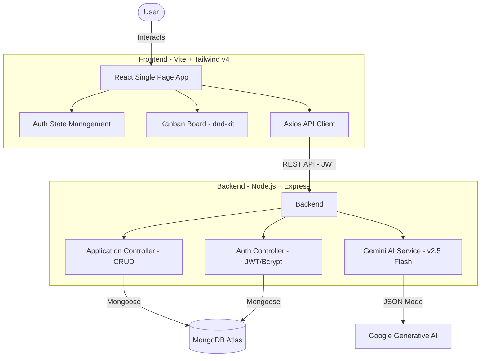

# AI-Assisted Job Application Tracker

A modern, full-stack MERN application designed to streamline the job hunt process. Featuring a dynamic Kanban board and integrated with Google's Gemini AI to parse job descriptions and generate tailored resume suggestions.

## 🚀 Features

- **AI Job Parsing**: Powered by Gemini 2.5 Flash. Paste a job description and instantly extract company names, roles, and key requirements.
- **Resume Optimization**: Automated generation of high-impact, tailored resume bullets for every application.
- **Dynamic Kanban Board**: Visualize your application progress across 5 stages (Applied, Phone Screen, Interview, Offer, Rejected) with drag-and-drop support.
- **Real-time Pipeline Stats**: Get instant insights into your total applications, interview conversion, and offer count.
- **Intelligent Search**: Find applications by company or role in real-time.
- **Dark Mode**: Fully themed interface for both light and dark preferences.
- **Secure Auth**: JWT-based authentication with protected user data and session management.

## 🏗️ Architecture



## Architecture & Design Decisions

While the initial specification requested the OpenAI API for this build, I made the architectural decision to integrate the Gemini 1.5 Flash API via `@google/generative-ai` instead. This ensures the project remains a completely free, cost-effective, and sustainable build for demonstration and portfolio purposes without sacrificing any capabilities. Gemini perfectly fulfills the core requirement of enforcing a strict "JSON output mode for structured responses" to accurately parse job descriptions and auto-fill the Kanban cards.

### Tech Stack Choices
- **AI Engine**: Utilizes **Gemini 2.5 Flash** (via Gemini 1.5 API) for state-of-the-art performance for structured JSON extraction and creative writing.
- **Styling**: Built with **Tailwind CSS v4**'s CSS-first approach for highly optimized, premium aesthetics and seamless dark mode integration.
- **State Management**: Uses **React Context API** for auth and optimized local state for pipeline management.
- **DND Logic**: Powered by **@dnd-kit** for its modular architecture and excellent accessibility features.

## 🛠️ Tech Stack

- **Frontend**: React, TypeScript, Vite, Tailwind CSS v4, Lucide React, dnd-kit, react-hot-toast.
- **Backend**: Node.js, Express, TypeScript, Mongoose, JWT, Bcrypt.
- **Database**: MongoDB Atlas.
- **AI**: Google Gemini AI (Gemini 2.5 Flash).

## ⚙️ Local Setup

### Prerequisites
- Node.js (v18+)
- MongoDB Atlas Account
- Google AI Studio API Key

### 1. Clone & Install Dependencies

```bash
# In the root directory
# Install backend dependencies
cd backend
npm install

# Install frontend dependencies
cd ../frontend
npm install
```

### 2. Environment Configuration

**Backend (`backend/.env`):**
Create a `.env` file in the `backend` folder and add:
```env
PORT=5000
MONGODB_URI=your_mongodb_connection_string
JWT_SECRET=your_jwt_secret_key
GEMINI_API_KEY=your_google_ai_key
```

### 3. Running the Project

**Start Backend:**
```bash
cd backend
npm run dev
```

**Start Frontend:**
```bash
cd frontend
npm run dev
```

The application will be running at `http://localhost:5173`.
